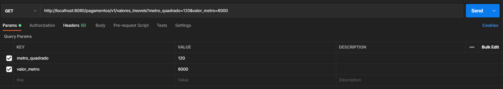
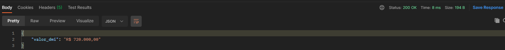

# WEBSERVICES PARA O CASE CYRELA | WEBSERVICES EM RESTFUL
Realizado tarefa - WEBSERVICES PARA O CASE CYRELA | WEBSERVICES EM RESTFUL

Tecnologias utilizadas:
  > JAVA 11 |
  > SPRING FRAMEWORK |
  > MODEL MAPPER |
  > SLF4J |
  > H2 DATABASE 

## ENDPOINT (GET) /pagamentos/v1/pagamentos/valores_imoveis ##
  
  **Descrição: Rota responsavel pelo calculo DMI (dados do mercado imobiliário)
  
**Parametros de entrada :**
campo  | descricao
------------- | -------------
valor_metro  | "Valor base do metro² na região"
metro_quadrado  | "Tamanho do metro² a ser vendido"

   
**Body de saída :** 
campo  | descricao
------------- | -------------
valor_dmi | "Valor calculado"

## ENDPOINT (post) /pagamentos/v1/pagamentos/valorizacoes ##

  **Descrição: Rota responsavel pelo calculo adicional dependendo das proximidas que se encontra do imovel (calculo fake usado só como exemplo)
  
**Body de entrada :**
campo  | descricao
------------- | -------------
escola  | "Imovel proximo de escola"
hospital  | "Imovel proximo de hospital"
farmacia  | "Imovel proximo de farmacia"
mercado  | "Imovel proximo de mercado"
shopping_center  | "Imovel proximo de shopping"
metro  | "Imovel proximo de metro"
bairro  | "bairro que esta localizado o imovel"

